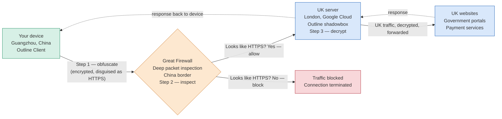

[← Back to overview](../README.md)

# 4. Process Flowchart — VPN Connection Routine

## 4.1 Monthly Bill Payment Flow

The following describes the end-to-end process for using the VPN to pay UK council bills from China. This represents the steady-state routine once the system is fully configured.

*Shadowsocks encrypted tunnel, obfuscated as HTTPS traffic — this is how standard VPN protocols are distinguished and blocked, and how Outline's obfuscation avoids that fate.*

| Step | Action | Actor | Notes |
|---|---|---|---|
| 1 | Open Google Cloud Console | User | Requires secondary VPN active in China |
| 2 | Navigate to Compute Engine → VM Instances | User | |
| 3 | Start VM — tick checkbox → click Start | User | VM takes ~60 seconds to fully boot |
| 4 | Wait for status dot to turn green | System | Do not proceed until VM shows green |
| 5 | Open Outline Client on device | User | Phone or laptop |
| 6 | Tap Connect | User | |
| 7 | Verify UK IP on ipleak.net | User | IPv4 must show London — abort if Chinese IP shown |
| 8 | Access UK payment portal | User | Portal accepts UK IP |
| 9 | Complete payment | User | |
| 10 | Disconnect Outline Client | User | Toggle off in app |
| 11 | Return to Google Cloud Console | User | |
| 12 | Stop VM — tick checkbox → click Stop | User | Reduces cost to ~$0.50/month |
| 13 | Confirm VM status dot turns grey | System | Compute billing stops |

## 4.2 Troubleshooting Decision Flow

If Outline Client fails to connect, follow this decision path:

| Check | If Yes | If No |
|---|---|---|
| Is the VM running (green dot)? | Proceed to next check | Start the VM and wait 60 seconds |
| Does ipleak.net show a UK IP? | VPN is working — proceed | Check Outline Client is toggled on |
| Does Outline Client show an error? | Check error type below | Toggle off and on again |
| Is the error an IP mismatch? | SSH in — run reinstall script | Proceed to next check |
| Is another VPN running on the device? | Disconnect and quit it first | Reinstall Outline Client cleanly |
| Has the VM been recently restarted? | Wait 90 seconds and retry | Contact support or recreate VM |

---

[← Back to overview](../README.md) · [← Previous: Kanban Methodology](03-kanban-methodology.md) · [Next: Retrospective →](05-retrospective.md)
